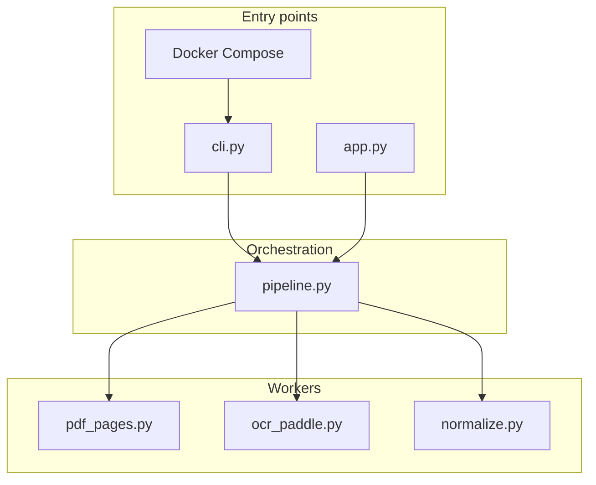
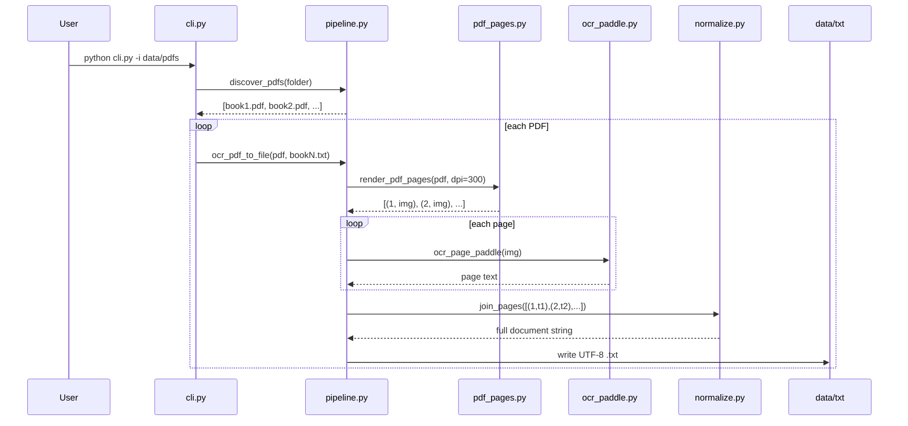

# BanglaDialectDataset — Full Build & Architecture Guide

This document explains **how this tool is built**, **how data flows**, and **how every file relates** — from a scanned Bengali PDF to a UTF-8 `.txt` book file.

**Engine policy:** **PaddleOCR only** (PaddleOCR-VL). No OpenAI / Claude / Gemini / paid APIs.

Related docs:
- [README.md](README.md) — quick start
- [TEAM_WORKFLOW.md](TEAM_WORKFLOW.md) — shared team host (Docker) so not everyone installs Paddle

---

## 1. What this project does

```text
data/pdfs/*.pdf   →   render pages to images   →   PaddleOCR-VL per page   →   data/txt/*.txt
```

- **Input:** one PDF *or* a folder of PDFs (CLI auto-discovers all of them).
- **Output:** one UTF-8 `.txt` per PDF, same filename stem (`book.pdf` → `book.txt`).
- **Format:** page markers + Unicode NFC text.

Example output:

```text
--- page 1 ---

…page text…

--- page 2 ---

…page text…
```

---

## 2. How we built it (design choices)

| Decision | Why |
|----------|-----|
| Python CLI-first | OCR libs (Paddle, PyMuPDF) are Python-first; model latency dominates, so Go/Rust does not help. |
| PaddleOCR-VL only | Open-source, Bengali-capable (~0.9B VLM). Classic PP-OCRv5 has no Bengali recognition model. |
| No paid APIs | Dataset paper / advisor preference: open-source automated pipeline. |
| Lazy import of Paddle | CLI can start and list PDFs even if Paddle is not installed yet; fails clearly at OCR time. |
| One `.txt` per book | Simple corpus layout for the dialect dataset paper. |
| Docker Compose for the team | Heavy deps + model download once on a shared host; teammates only drop PDFs / collect `.txt`. |

Advisor context (summary): open-source models, automated CLI, try Paddle (not Go/Rust), paid OCR only if open-source quality fails — we stayed on Paddle only.

---

## 3. Repository map (every important file)

```text
BanglaDialectDataset/
├── cli.py                 # Main entry — batch OCR (1..N PDFs → 1..N .txt)
├── app.py                 # Optional Streamlit demo (same pipeline)
├── Dockerfile             # Container image for shared host
├── docker-compose.yml     # Mount data/pdfs + data/txt for the team
├── requirements.txt       # Python deps (core + paddleocr)
├── requirements-paddle.txt# Alias / notes for paddle extras
├── requirements-ui.txt    # Streamlit only (optional)
├── .env.example           # Config template (copy to .env)
├── GUIDE.md               # This file
├── TEAM_WORKFLOW.md       # How the team shares one OCR machine
├── README.md              # Short quick start
├── src/
│   ├── __init__.py
│   ├── pipeline.py        # Brain: discover PDFs, call OCR, write files
│   ├── pdf_pages.py       # PDF → PIL images (PyMuPDF)
│   ├── ocr_paddle.py      # PaddleOCR-VL (and optional classic PP-OCR)
│   └── normalize.py       # NFC + page markers
└── data/
    ├── pdfs/              # Drop input books here
    ├── txt/               # OCR outputs land here
    └── samples/           # Tiny smoke-test assets
```

---

## 4. File relations (who calls whom)



### Import / call graph (text)

```text
cli.py
  └─ pipeline.discover_pdfs()          # 1 PDF or N PDFs in a folder
  └─ pipeline.ocr_pdf_to_file()        # for each PDF
        └─ ocr_pdf_to_text()
              └─ iter_ocr_pages()
                    ├─ pdf_pages.render_pdf_pages()   # PDF → images
                    └─ ocr_paddle.ocr_page_paddle()   # image → text
              └─ normalize.join_pages()               # pages → one string
        └─ Path.write_text()                          # → data/txt/<stem>.txt

app.py  →  same pipeline functions (preview in browser instead of only writing)
```

**Rule:** UI and CLI never talk to Paddle directly. Only `pipeline` / `ocr_paddle` do.

---

## 5. End-to-end data flow



---

## 6. Code segment guide (what each module does)

### `cli.py` — batch door

**Job:** Parse flags, discover PDFs, loop, show progress, write summary.

Critical segments:

1. **Auto-detect 1..N PDFs** via `discover_pdfs(args.input, recursive=...)`.
2. **Print the list** so you see what will run.
3. **Per PDF:** map `book.pdf` → `data/txt/book.txt` (or `book_2.txt` if name taken and not `--force`).
4. **`--skip-existing`:** resume a long corpus without redoing finished books.

```bash
# Folder with many PDFs → many .txt
python cli.py -i data/pdfs -o data/txt --skip-existing

# Single file
python cli.py -i data/pdfs/one_book.pdf -o data/txt

# Nested folders
python cli.py -i data/pdfs --recursive --skip-existing
```

### `src/pipeline.py` — brain

| Function | Role |
|----------|------|
| `discover_pdfs` | File → `[that]`; dir → all `*.pdf` (optional recursive) |
| `iter_ocr_pages` | Render + OCR, yield `(page_number, text)` |
| `ocr_pdf_to_text` | Join all pages into one string |
| `ocr_pdf_to_file` | Write UTF-8 file |
| `resolve_default_engine` | Reads `OCR_ENGINE`, else `paddle` |
| `unique_path` | Avoid silent overwrite (`book_2.txt`, …) |

Engine list is only `("paddle",)` — paid engines were removed on purpose.

### `src/pdf_pages.py` — PDF → images

Uses **PyMuPDF** (`fitz`). No Poppler install needed.

- `dpi=300` default (good for scanned books).
- Returns `(1-based page number, PIL.Image)`.

### `src/ocr_paddle.py` — image → text

| Piece | Role |
|-------|------|
| `_wanted_backend()` | `PADDLE_OCR_BACKEND`: `vl` (default), `ppocr`, `auto` |
| `_init_vl()` | `PaddleOCRVL` — Bengali-capable path |
| `_init_ppocr()` | Classic PP-OCR (no Bengali in v5; kept for experiments) |
| `ocr_page_paddle()` | Run predict/ocr, extract plain text |
| `paddle_status()` | Lightweight import check for UI |

**Why VL by default:** PP-OCRv5 multilingual list does not include Bengali; PaddleOCR-VL (~0.9B) covers 100+ languages including Bengali.

Env knobs:

```text
OCR_ENGINE=paddle
PADDLE_OCR_BACKEND=vl
PADDLE_OCR_DEVICE=cpu          # or gpu:0
PADDLE_PDX_DISABLE_MODEL_SOURCE_CHECK=True
```

### `src/normalize.py` — text cleanup

- Unicode **NFC** (stable Bangla combining forms).
- Collapse messy whitespace.
- Insert `--- page N ---` markers via `join_pages`.

### `app.py` — optional UI

Same brain as CLI. Useful for demos; **corpus work should use `cli.py` or Docker**.

---

## 7. Local install (one developer machine)

```bash
cd EDGE/BanglaDialectDataset
py -3.13 -m venv .venv
.venv\Scripts\activate          # Windows
# source .venv/bin/activate     # Linux/macOS

pip install paddlepaddle==3.3.0 -i https://www.paddlepaddle.org.cn/packages/stable/cpu/
pip install -r requirements.txt

copy .env.example .env          # optional tweaks

# Drop PDFs, then:
python cli.py -i data/pdfs -o data/txt --skip-existing
```

First Paddle run downloads models into `~/.paddlex` (can take several minutes).

Smoke-test one page:

```bash
python cli.py -i data/pdfs/book.pdf -o data/txt --page-start 1 --page-end 1
```

---

## 8. Publishing / sharing the CLI

| Approach | Who installs Paddle? | Best for |
|----------|----------------------|----------|
| **Git clone + local venv** | Each person | Solo / power users |
| **Docker Compose on one host** (recommended) | Only the host | Whole research team |
| Streamlit Cloud | Cloud | Not suitable for heavy VL models |
| MongoDB | N/A | **Not needed** for a `.txt` corpus |
| GitHub Actions OCR | CI runners | Possible but slow / quota-heavy for big books |

**Most effective for your team:** run OCR **once** on a shared Docker host; store all `.txt` in one `data/txt` folder (synced or committed). See [TEAM_WORKFLOW.md](TEAM_WORKFLOW.md).

Anyone with the repo can still run locally — Docker does not block that.

---

## 9. Output contract (dataset paper)

- Encoding: UTF-8
- Normalization: Unicode NFC
- One file per book: `data/txt/<pdf_stem>.txt`
- Page markers for QA / re-OCR of a single page later

Methods blurb:

> Scanned Bengali book PDFs were rendered with PyMuPDF (300 DPI) and transcribed with open-source PaddleOCR-VL via an automated CLI batch pipeline, producing UTF-8 plain text with Unicode NFC normalization and page markers.

---

## 10. Troubleshooting

| Symptom | Fix |
|---------|-----|
| `No PDFs found` | Put files in `data/pdfs/` or pass `-i path` |
| Paddle import / VL dependency error | `pip install -r requirements.txt` after installing `paddlepaddle` wheel |
| Slow first run | Model download — wait; use Docker volume `paddle_models` to cache |
| CPU very slow | Expected for VL; prefer a GPU host (`PADDLE_OCR_DEVICE=gpu:0` + GPU paddle wheel) |
| Want to re-OCR | `--force` or delete the `.txt` |
| Resume corpus | `--skip-existing` |

---

## 11. Mental model (one sentence)

> **`cli.py` asks `pipeline` to find every PDF; for each book, `pdf_pages` turns pages into images, `ocr_paddle` reads them with PaddleOCR-VL, `normalize` stitches UTF-8 text, and the result is one `.txt` per PDF in `data/txt/`.**
