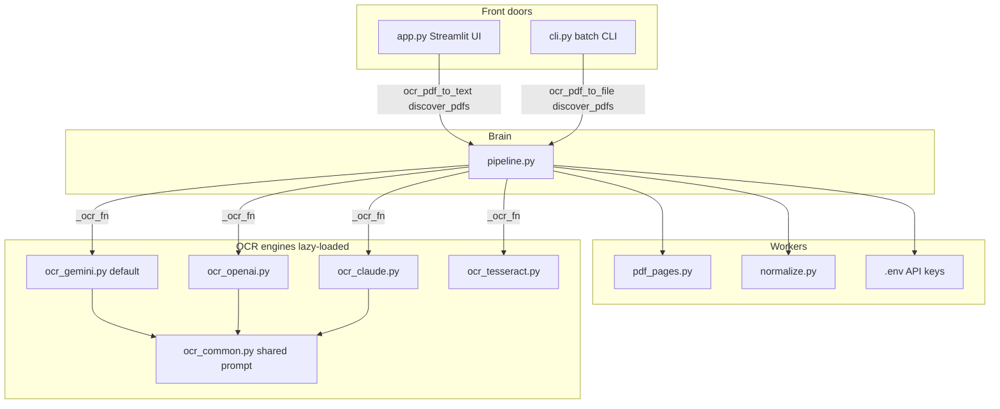
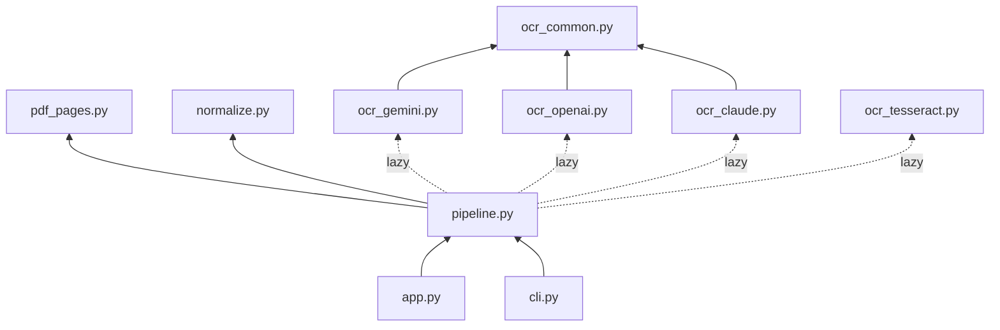
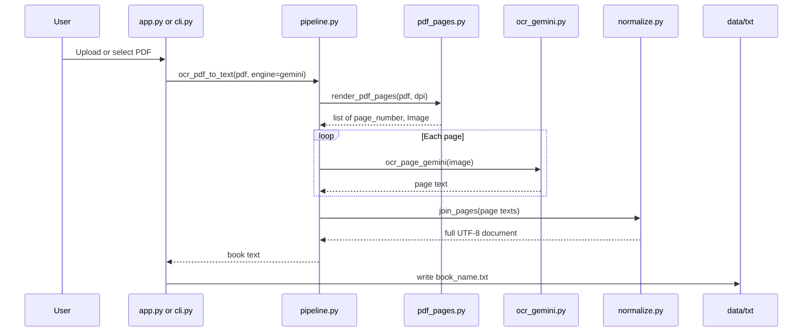

# How This OCR System Works (File Relations & Logic)

This guide explains **how the code is wired together**: which file calls which, what each file’s job is, and the exact data flow from PDF → `.txt`.

---

## 1. Big picture

There are **two front doors** and **one brain**:

| Door | File | Who uses it |
|------|------|-------------|
| Web UI | `app.py` | You in the browser (`streamlit`) |
| Terminal | `cli.py` | Batch jobs / scripts |
| Brain | `src/pipeline.py` | Both doors call this |

`app.py` and `cli.py` do **not** talk to Gemini/OpenAI/Claude/Tesseract directly. They only collect settings (engine, DPI, paths) and call `pipeline`. The pipeline then calls the smaller modules.

### Architecture (who calls whom)



### Data flow (PDF → .txt)

```mermaid
flowchart LR
  PDF[Scanned PDF] --> Render[pdf_pages.render_pdf_pages]
  Render --> Images["list of page_number, Image"]
  Images --> Loop[For each page]
  Loop --> OCR["ocr_page_gemini / openai / claude / tesseract"]
  OCR --> PageText[page text string]
  PageText --> Collect["list of page_number, text"]
  Collect --> Join[normalize.join_pages]
  Join --> Doc["UTF-8 book text with page markers"]
  Doc --> File["data/txt/book_name.txt"]
```



### Module dependency graph



---

## 2. Import / dependency graph (who imports whom)

Arrows in the mermaid graph above mean **“depends on / imports from”**.

Text summary:

```text
app.py / cli.py  →  pipeline.py
pipeline.py      →  pdf_pages.py, normalize.py
pipeline.py      ─(lazy)→  ocr_gemini / ocr_openai / ocr_claude / ocr_tesseract
ocr_gemini / ocr_openai / ocr_claude  →  ocr_common.py
```

**Important design:** `pipeline` does **lazy import** of OCR engines inside `_ocr_fn()`.

- Why: if `anthropic` / `openai` is not installed, the app can still start and use Gemini.
- How: only when you pick that engine does Python load its `ocr_*.py` module.

Config files (not imported as Python modules, but related):

| File | Role |
|------|------|
| `.env` | Real API keys (gitignored). Loaded by `pipeline` via `python-dotenv`. Active key for now: `GEMINI_API_KEY` (OpenAI/Claude lines commented). |
| `.env.example` | Template showing which keys exist. |
| `requirements.txt` | Packages both local venv and Streamlit Cloud install. |
| `.gitignore` | Keeps `.env`, `data/pdfs`, `data/txt`, `.venv` out of git. |

---

## 3. End-to-end call chain (one PDF)

When you OCR `data/pdfs/mybook.pdf` with engine `gemini` (current default):



```text
1. app.py  _run_one(...)
      OR
   cli.py  main() → ocr_pdf_to_file(...)

2. pipeline.ocr_pdf_to_text(pdf, engine="gemini", dpi=300)
      │
      ├─► pdf_pages.render_pdf_pages(pdf, dpi=300)
      │      opens PDF with PyMuPDF
      │      returns [(1, Image), (2, Image), ...]
      │
      ├─► _ocr_fn("gemini")  →  ocr_page_gemini
      │
      ├─► for each (page_number, image):
      │      text = ocr_page_gemini(image)
      │         │
      │         ├─ reads GEMINI_API_KEY from env
      │         ├─ sends OCR_SYSTEM_PROMPT + OCR_USER_PROMPT + PIL image to Gemini
      │         └─ returns raw transcribed string
      │
      │      collect (page_number, text)
      │
      └─► normalize.join_pages([(1, "..."), (2, "...")])
             for each page: normalize_text()  → NFC + tidy whitespace
             glue with "--- page N ---"
             return one big string

3. Write UTF-8 file:
   app.py  → data/txt/mybook.txt  (and offer download)
   cli.py  → same via ocr_pdf_to_file()
```

Same chain for OpenAI / Claude / Tesseract — only the middle function changes (`ocr_page_openai` / `ocr_page_claude` / `ocr_page_tesseract`).

---

## 4. Each file: job, logic, relations

### `app.py` — UI layer only

**Job:** Draw the Streamlit screen; collect user choices; show progress; save/download `.txt`.

**Does NOT:** Call OpenAI itself, render PDFs, or normalize text.

**Relations:**
- Imports from `src.pipeline`: `ENGINES`, `resolve_default_engine`, `count_pages`, `discover_pdfs`, `ocr_pdf_to_text`
- Writes uploads into `data/pdfs/`
- Writes results into `data/txt/`

**Logic flow inside:**
1. Sidebar → user picks `engine`, `dpi`, overwrite flag
2. Tab “Upload” → save PDF bytes to disk → `_run_one(...)`
3. Tab “Folder” → `discover_pdfs(data/pdfs)` → `_run_one` for each
4. `_run_one` calls `ocr_pdf_to_text(...)` with an `on_progress` callback that updates the Streamlit progress bar
5. Shows preview + download button

**`sys.path` trick:** Streamlit Cloud runs from the **repo root**, so `from src.pipeline` would fail unless we insert `BanglaDialectDataset/` onto `sys.path`. Local runs from that folder also work with the same code.

---

### `cli.py` — batch layer only

**Job:** Parse CLI flags; loop PDFs; print progress with `tqdm`.

**Relations:**
- Imports from `src.pipeline`: `ENGINES`, `discover_pdfs`, `ocr_pdf_to_file`, `resolve_default_engine`
- Default paths: `data/pdfs` → `data/txt`

**Logic:**
1. Parse `--input`, `--output`, `--engine`, `--dpi`, page range, `--force`
2. `discover_pdfs(input)` → list of PDF paths
3. For each PDF, output = `output/<stem>.txt`
4. Skip if file exists and not `--force`
5. Call `ocr_pdf_to_file(...)` (pipeline writes the file)

`cli` uses `ocr_pdf_to_file`; `app` uses `ocr_pdf_to_text` then writes itself so it can preview before/while saving. Same OCR core either way.

---

### `src/pipeline.py` — the brain (orchestration)

**Job:** Connect rendering + OCR + joining + file I/O. Single place that knows the full recipe.

**Relations (outbound):**
| Function | Calls |
|----------|--------|
| `iter_ocr_pages` | `render_pdf_pages` → then per-page OCR fn |
| `ocr_pdf_to_text` | `iter_ocr_pages` → `join_pages` |
| `ocr_pdf_to_file` | `ocr_pdf_to_text` → `Path.write_text` |
| `_ocr_fn` | lazy-imports one of the three `ocr_*.py` modules |
| startup | `load_dotenv(ROOT / ".env")` so keys exist before OCR |

**Key functions:**

```text
resolve_default_engine()
  if GEMINI_API_KEY (or GOOGLE_API_KEY) → "gemini"
  else if OPENAI_API_KEY → "openai"
  else if ANTHROPIC_API_KEY → "claude"
  else → "tesseract"

_ocr_fn(engine) → function(image) -> str
  "gemini"    → ocr_page_gemini
  "openai"    → ocr_page_openai
  "claude"    → ocr_page_claude
  "tesseract" → ocr_page_tesseract

iter_ocr_pages(...)  → yields (page_number, text) one by one
ocr_pdf_to_text(...) → full document string
ocr_pdf_to_file(...) → writes .txt (skip if exists unless force)
discover_pdfs(path)  → [Path, ...] for one file or a folder
```

`count_pages` is re-exported from `pdf_pages` so the UI can show “N pages” without importing `pdf_pages` itself.

---

### `src/pdf_pages.py` — PDF → images

**Job:** Turn each PDF page into a PIL RGB image.

**Relations:** Used only by `pipeline` (and `count_pages` for the UI). No OCR knowledge.

**Logic:**
1. Open PDF with PyMuPDF (`fitz`)
2. Scale = `dpi / 72` (PDF points → pixels)
3. `page.get_pixmap` → raw pixels → `PIL.Image`
4. Return `[(1, img), (2, img), ...]`

Why PyMuPDF: works on Windows without installing Poppler (unlike `pdf2image`).

---

### `src/ocr_common.py` — shared OCR contract

**Job:** One strict system/user prompt + image encoding helpers used by **both** VLMs.

**Relations:**
- Imported by `ocr_gemini.py`, `ocr_openai.py`, and `ocr_claude.py`
- **Not** imported by Tesseract (Tesseract has no prompt)

**Logic:**
- `OCR_SYSTEM_PROMPT` — forces verbatim OCR (no translate/fix/guess/markdown)
- `OCR_USER_PROMPT` — short “transcribe this page” instruction
- `image_to_png_bytes` / `image_to_data_url` — PIL image → bytes / base64 data URL (used by OpenAI/Claude)

Changing the prompt here changes Gemini, OpenAI, **and** Claude behavior together. That is intentional.

---

### `src/ocr_gemini.py` — one page → text (Gemini, default)

**Relations:** `ocr_common` + `google-genai` SDK + `GEMINI_API_KEY`.

**Logic:**
1. Require API key (`GEMINI_API_KEY` or `GOOGLE_API_KEY`)
2. `client.models.generate_content` with `gemini-2.0-flash`, `temperature=0`
3. Contents = user prompt + PIL image; system instruction = OCR prompt
4. Return `response.text` stripped

Input type: `PIL.Image`  
Output type: `str`

---

### `src/ocr_openai.py` — one page → text (GPT-4o, optional)

**Relations:** `ocr_common` + `openai` SDK + `OPENAI_API_KEY`.

**Logic:**
1. Require API key
2. Convert page image to data URL
3. `chat.completions.create` with `model="gpt-4o"`, `temperature=0`
4. Messages = system prompt + user text + image
5. Return `message.content` stripped

Same `(image) -> str` contract as Gemini.

---

### `src/ocr_claude.py` — one page → text (Claude, optional)

**Same contract as OpenAI** (`image → str`), different API shape:

- Uses Anthropic SDK
- Image sent as base64 PNG block (not data URL)
- Same prompts from `ocr_common`

Because the function signature matches OpenAI’s, `pipeline._ocr_fn` can swap engines without changing the loop.

---

### `src/ocr_tesseract.py` — one page → text (local)

**Relations:** `pytesseract` + system Tesseract binary with `ben` (+ `eng`) language data.

**Logic:** `image_to_string(image, lang="ben+eng")`. No cloud, no prompt file.

Same signature `(image) -> str` so it plugs into the same pipeline loop.

---

### `src/normalize.py` — clean & assemble the book text

**Relations:** Called by `pipeline.ocr_pdf_to_text` via `join_pages`. Does not know about PDFs or APIs.

**Logic:**

```text
normalize_text(raw):
  Unicode NFC          # stable Bangla combining characters
  unify newlines
  collapse spaces/tabs
  collapse 3+ blank lines → 2
  strip edges

join_pages([(1, t1), (2, t2), ...]):
  for each page:
    cleaned = normalize_text(t)
    skip if empty
    append "--- page N ---"
    append cleaned
  return one UTF-8 string ending with newline
```

**Why page markers:** later you can split the book by page, re-OCR one bad page, or spot where quality drops.

---

## 5. Data shapes between files

| Stage | Type | Produced by | Consumed by |
|-------|------|-------------|-------------|
| PDF path | `Path` | `app` / `cli` / `discover_pdfs` | `pipeline`, `pdf_pages` |
| Page images | `list[tuple[int, Image]]` | `pdf_pages.render_pdf_pages` | `pipeline.iter_ocr_pages` |
| Page text | `str` | `ocr_*` | `pipeline` collector |
| Page list | `list[tuple[int, str]]` | `iter_ocr_pages` | `normalize.join_pages` |
| Book text | `str` (UTF-8) | `join_pages` | `app` preview / `ocr_pdf_to_file` write |
| Output file | `data/txt/<name>.txt` | `app` or `pipeline.ocr_pdf_to_file` | you / dataset pipeline |

Every OCR backend is forced into the same interface:

```text
ocr_page_*(image: PIL.Image) -> str
```

That is the **plug** that lets three engines share one loop in `pipeline`.

---

## 6. Config & secrets flow

```text
Local:
  .env  ──load_dotenv──►  os.environ  ──►  ocr_gemini (default) / openai / claude

Streamlit Cloud:
  Secrets TOML  ──inject──►  os.environ  ──►  same code paths
  Example: GEMINI_API_KEY = "..."
  (no .env file on Cloud; do not commit .env)
```

`resolve_default_engine()` only **reads** env vars; it never prints keys.

---

## 7. Why files are split this way

| Split | Reason |
|-------|--------|
| UI (`app`) vs CLI (`cli`) vs brain (`pipeline`) | Change the UI without touching OCR; reuse one pipeline in both doors |
| `pdf_pages` separate from OCR | Rendering is local CPU; OCR is API/Tesseract — different failure modes |
| Three `ocr_*.py` + shared `ocr_common` | Same prompt/contract; swap provider without rewriting the loop |
| `normalize` separate | Post-processing stays testable without calling APIs |
| Lazy imports in `_ocr_fn` | Missing Claude package must not crash OpenAI-only use |

---

## 8. Minimal mental model

Remember this one sentence:

> **`app` / `cli` ask `pipeline`; `pipeline` turns PDF pages into images, sends each image to one `ocr_*` function, then `normalize` stitches the strings into a UTF-8 book file.**

If you need to change behavior:

| Want to change… | Edit this file |
|-----------------|----------------|
| Buttons / layout / upload UX | `app.py` |
| CLI flags / batch defaults | `cli.py` |
| Order of steps / skip logic / default engine | `src/pipeline.py` |
| DPI rendering / page crop | `src/pdf_pages.py` |
| “Don’t translate / don’t fix spelling” rules | `src/ocr_common.py` |
| Gemini model name / API call | `src/ocr_gemini.py` |
| OpenAI model name / API call | `src/ocr_openai.py` |
| Claude model name / API call | `src/ocr_claude.py` |
| Local OCR language | `src/ocr_tesseract.py` |
| NFC / page markers / whitespace | `src/normalize.py` |
| Which packages install | `requirements.txt` |

---

## 9. Quick local run (for testing the wiring)

```bash
cd EDGE/BanglaDialectDataset
.venv/Scripts/python -m streamlit run app.py
# or
.venv/Scripts/python cli.py -i data/pdfs -o data/txt --engine gemini --page-start 1 --page-end 1
```

Put a PDF in `data/pdfs/`. Result appears in `data/txt/` with the same basename.
