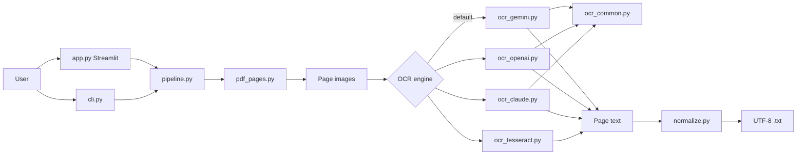
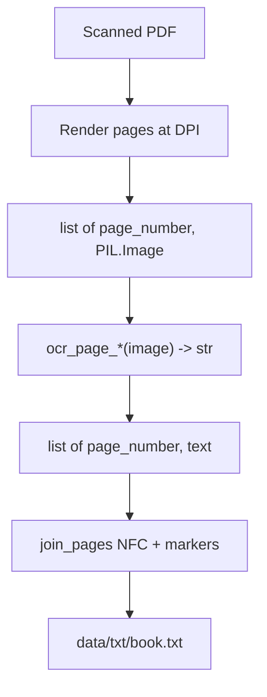

# BanglaDialectDataset — Bengali Book OCR

Tool to OCR scanned Bengali (Bangla) book PDFs and save plain UTF-8 `.txt` files for the BanglaDialectDataset paper contribution.

No machine-learning training is required to run this tool.

- [GUIDE.md](GUIDE.md) — full walkthrough of how the tool was built (architecture, modules, Cloud deploy)

## Pipeline & data flow





## Features

- **Streamlit UI** for upload / folder batch OCR
- **CLI** for reproducible batch runs
- Engines:
  - `gemini` — Gemini 2.0 Flash vision (**default** when `GEMINI_API_KEY` is set)
  - `openai` — GPT-4o vision (optional)
  - `claude` — Claude vision (optional)
  - `tesseract` — local Bengali+English OCR (offline fallback)
- Output: one UTF-8 NFC-normalized `.txt` per PDF, with `--- page N ---` markers

## Setup

```bash
cd EDGE/BanglaDialectDataset
py -3.13 -m venv .venv
# Windows Git Bash / PowerShell:
source .venv/Scripts/activate   # or: .venv\Scripts\Activate.ps1
pip install -r requirements.txt
```

On Git Bash, `streamlit` may still resolve to Anaconda. Prefer the venv explicitly:

```bash
.venv/Scripts/python -m streamlit run app.py
```

Copy `.env.example` to `.env` and set keys:

```bash
# OPENAI_API_KEY=sk-...
# ANTHROPIC_API_KEY=sk-ant-...
GEMINI_API_KEY=your-gemini-api-key
```
### Optional: Tesseract (offline)

1. Install [Tesseract for Windows](https://github.com/UB-Mannheim/tesseract/wiki)
2. Include the **Bengali (`ben`)** language pack (and English)
3. Ensure `tesseract` is on your `PATH`

## Usage

### Streamlit

```bash
.venv/Scripts/python -m streamlit run app.py
```

Do **not** run bare `streamlit run app.py` if Anaconda is on your PATH — it will miss project deps.
- Upload PDFs, or drop files into `data/pdfs/` and use **Process folder**
- Results land in `data/txt/<book>.txt`

### CLI

```bash
python cli.py --input data/pdfs --output data/txt --engine gemini
python cli.py -i book.pdf -o data/txt --engine openai --dpi 300
python cli.py -i book.pdf -o data/txt --engine claude
python cli.py -i data/pdfs -o data/txt --engine tesseract --force
python cli.py -i book.pdf -o data/txt --page-start 1 --page-end 5
```
Existing `.txt` files are skipped unless `--force` / “Overwrite existing” is set.

## Output format

```text
--- page 1 ---

<extracted text>

--- page 2 ---

<extracted text>
```

- Encoding: UTF-8
- Normalization: Unicode NFC; collapsed runaway whitespace
- Bangla script, Latin, digits, and punctuation (including `।`) are preserved

## Methods blurb (paper)

> Scanned Bengali book PDFs were rendered to page images with PyMuPDF at 300 DPI. Text was extracted with a vision-language model (Google Gemini 2.0 Flash by default; optionally OpenAI GPT-4o or Anthropic Claude) prompted for verbatim OCR without translation or correction. A local Tesseract (`ben+eng`) path was retained as an offline baseline. Outputs were written as UTF-8 plain text with Unicode NFC normalization and explicit page markers.

## Layout

```text
BanglaDialectDataset/
  app.py              # Streamlit UI
  cli.py              # batch CLI
  requirements.txt
  .env.example
  src/
    pdf_pages.py
    ocr_openai.py
    ocr_claude.py
    ocr_tesseract.py
    normalize.py
    pipeline.py
  data/
    pdfs/             # drop scanned books here
    txt/              # OCR outputs
```

`data/pdfs/**` and `data/txt/**` are gitignored (except `.gitkeep`). Never commit `.env`.
