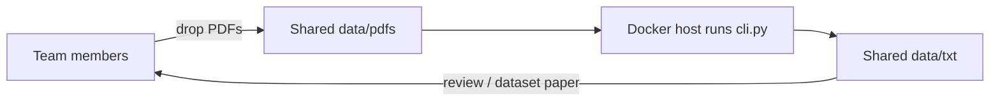

# Team workflow — one OCR host, shared `.txt` corpus

Not every teammate can (or should) install PaddleOCR-VL. **Most effective approach:** run the program in **one place** (Docker), keep **all outputs in one folder**, and let the team only contribute PDFs / review text.

## Recommendation (short)

| Option | Verdict |
|--------|---------|
| **Docker Compose on one lab PC or VPS** | **Best.** Install once, share `data/pdfs` + `data/txt`. |
| Local install for everyone | Works, but heavy (models + deps) per laptop. |
| MongoDB | **Overkill.** You need files for the paper, not a document DB. |
| CI/CD (GitHub Actions) | Possible for tiny smokes; poor for multi-hundred-page books (time/quota). |
| Online “CLI platforms” / Streamlit Cloud | Weak fit for multi-GB models and long CPU jobs. |

**Do this:** one Docker host + shared folders (OneDrive/Google Drive sync *or* a small VPS with SSH). Optionally commit finished `.txt` to Git (LFS if large).



---

## Roles

| Role | Does |
|------|------|
| **Host maintainer** (1 person) | Installs Docker, runs `docker compose`, keeps disk free |
| **Contributors** | Add scanned PDFs into the shared `data/pdfs` folder |
| **Reviewers** | Read / fix `data/txt` quality; track which books are done |

Nobody else needs a Python venv with Paddle.

---

## Setup on the shared host

### 1. Clone the repo

```bash
git clone <your-repo-url>
cd EDGE/BanglaDialectDataset
```

### 2. Create folders (if missing)

```bash
mkdir -p data/pdfs data/txt
```

### 3. Build the image (once)

```bash
docker compose build
```

First build downloads Paddle wheels; first **run** downloads VL models into the `paddle_models` volume.

### 4. Team drops PDFs

Copy books into:

```text
data/pdfs/
  book_a.pdf
  book_b.pdf
  ...
```

If you use OneDrive/Google Drive: sync that `data/` directory on the host machine.

### 5. Run batch OCR

```bash
docker compose run --rm ocr
```

Equivalent to:

```bash
python cli.py -i data/pdfs -o data/txt --engine paddle --skip-existing
```

- **Auto-detects** 1 or many PDFs in the folder.
- Writes **one `.txt` per PDF** into `data/txt/`.
- `--skip-existing` means re-runs only process new books (safe for the whole team).

Smoke-test one book / few pages (override command):

```bash
docker compose run --rm ocr -i data/pdfs/book_a.pdf -o data/txt --page-start 1 --page-end 2
```

### 6. Collect results

```text
data/txt/
  book_a.txt
  book_b.txt
```

Everyone with sync/SSH access sees the same files.

---

## How teammates work day-to-day

1. Add new PDF(s) to the shared `data/pdfs/`.
2. Message the host maintainer *or* use a scheduled task (below).
3. Wait for `.txt` to appear in `data/txt/`.
4. Review text; if a book is bad quality, delete its `.txt` and re-run with `--force` for that file.

Naming rule: `MyBook.pdf` → `MyBook.txt`. If `MyBook.txt` already exists and you do not use `--force` / `--skip-existing`, CLI writes `MyBook_2.txt` so nothing is silently overwritten.

---

## Optional: cron / Task Scheduler

On the host, run every hour (resume-friendly):

```bash
cd /path/to/BanglaDialectDataset
docker compose run --rm ocr
```

Windows Task Scheduler or Linux `cron` both work. Contributors only drop PDFs; OCR happens automatically.

---

## Sharing the `.txt` corpus in Git

PDFs are usually too large for Git (and are gitignored). Recommended:

1. Keep PDFs on the shared drive / host disk only.
2. Commit **finished** `.txt` files to a branch like `dataset-txt` (or use Git LFS).
3. Or zip `data/txt` periodically and store on Drive.

Do **not** put API keys or `.env` secrets in the repo (there are none for Paddle-only).

---

## Local use (still supported)

Anyone who *can* run it locally:

```bash
py -3.13 -m venv .venv
.venv\Scripts\activate
pip install paddlepaddle==3.3.0 -i https://www.paddlepaddle.org.cn/packages/stable/cpu/
pip install -r requirements.txt
python cli.py -i data/pdfs -o data/txt --skip-existing
```

Same code path as Docker — only the runtime differs.

---

## Why not MongoDB / heavy CI?

- The deliverable is **plain text files** for a dataset paper → filesystem + Git is the right store.
- MongoDB adds ops cost without helping OCR.
- CI runners time out on long books and re-download models unless you invest in caching/GPU runners.

Docker on one machine gives you: **one install, one model cache, one output folder, many contributors.**

---

## Checklist for the host maintainer

- [ ] Docker Desktop / Engine installed
- [ ] `docker compose build` succeeded
- [ ] `data/pdfs` and `data/txt` shared with the team (sync or SSH)
- [ ] First successful `docker compose run --rm ocr` on a tiny PDF
- [ ] Agree on naming: one PDF stem = one book id
- [ ] Optional: hourly scheduled run with `--skip-existing`
